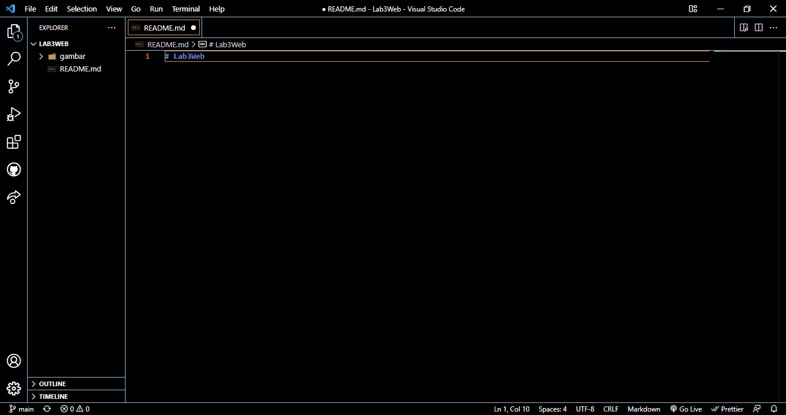
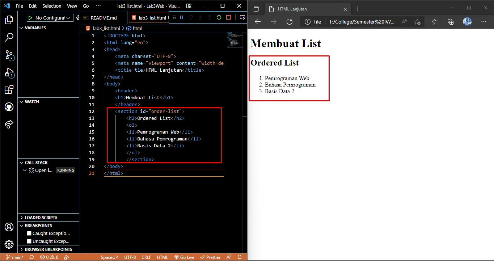
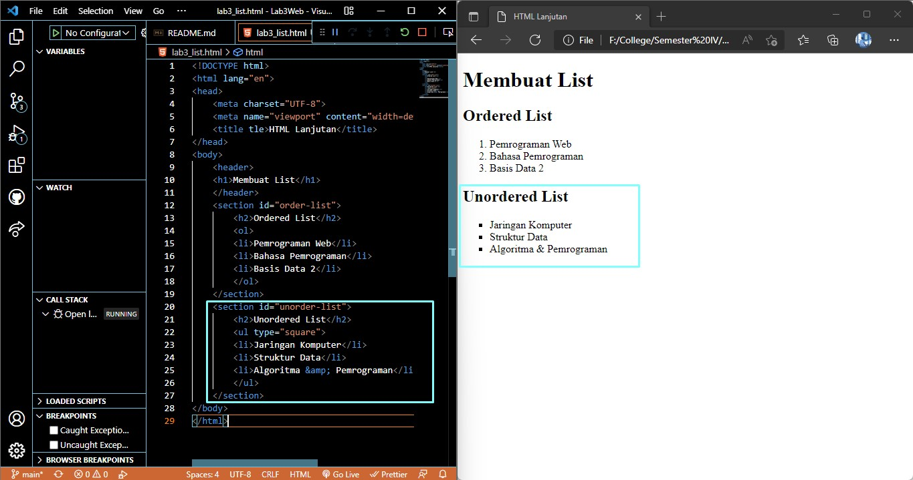
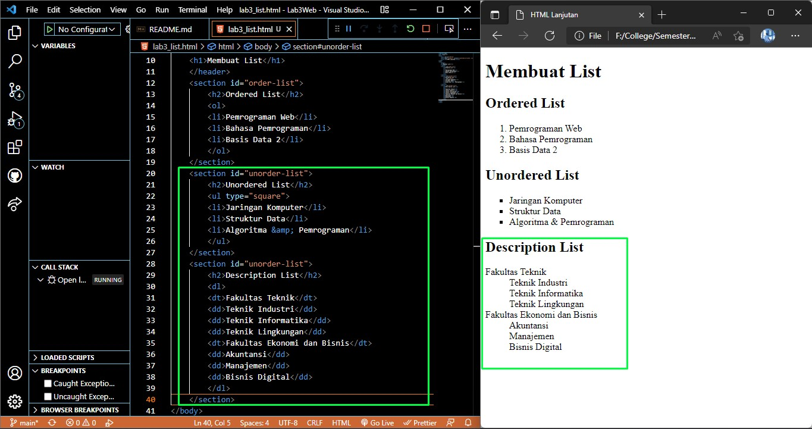
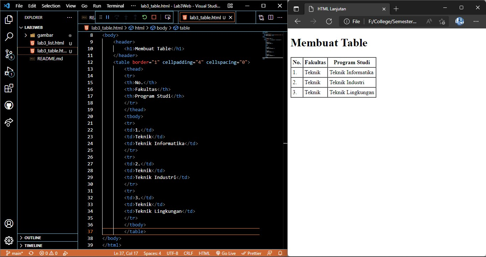
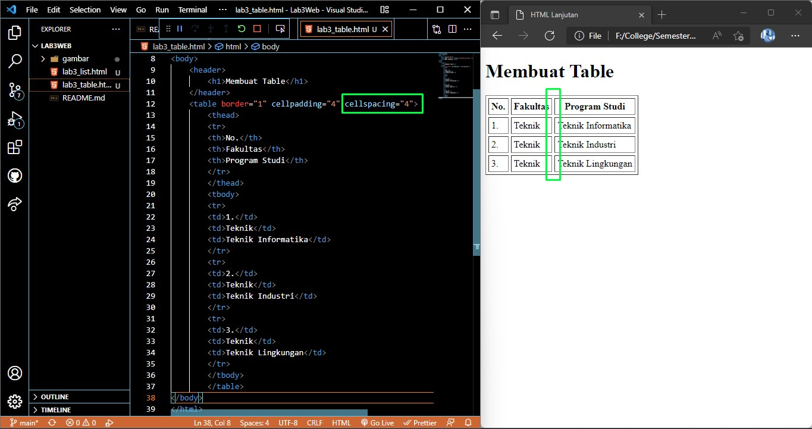
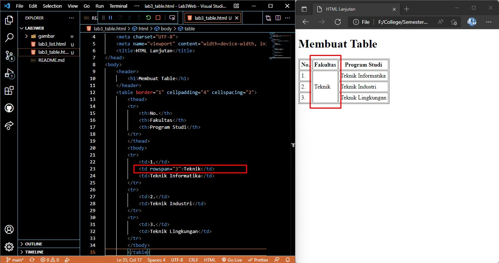
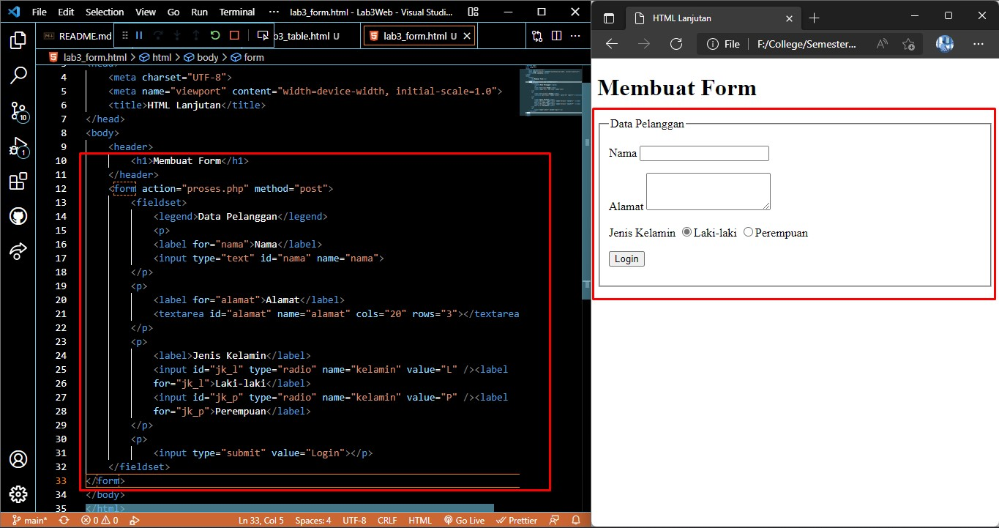
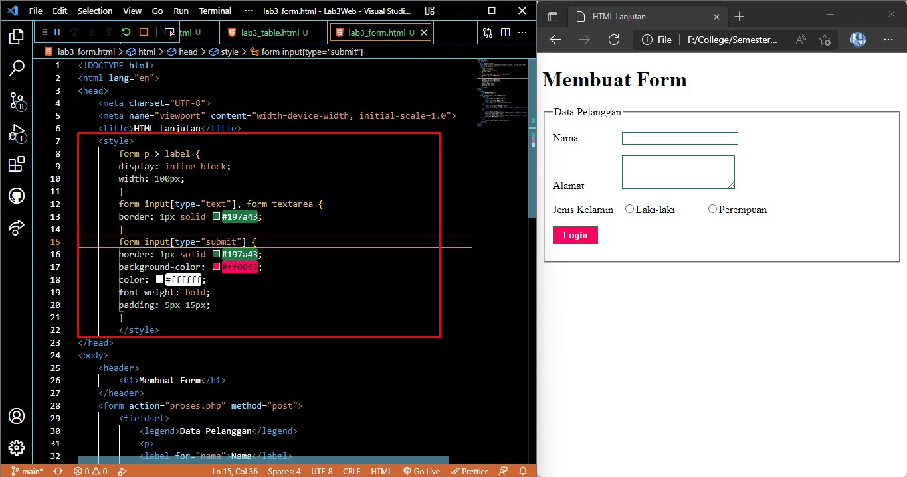

# Praktikum 3
Naufal Nirwansyah 312010174  TI. 20. A1 Pemrograman Web
  

## Langkah-langkah Praktikum 3

  Membuka editor yang kita gunakan, disini saya menggunakan Visual Code 
  

### Membuat Ordered List

Tambahkan kode untuk membuat `Ordered List` seperti berikut, dan kita running di Browser yang kita gunakan.  
  
Dari kode yang kita ketik seperti diatas akan menunjukkan output berupa list yang teratur.    

### Membuat Unordered List

Dari kode diatas kemudian kita tambakan kode untuk membuat `Unordered List`, setelah deklarasi ordered list pada section unordered-list, seperti berikut.  
    

### Membuat Description List
Kita lanjut di file yang sama kemudian tambahkan kode untuk membuat `Description List` setelah deklarasi unorderd-list.  

### Membuat Table
Buat file baru dengan nama `lab3_tabel.html`, Kemudian tambahkan kode untuk membuat tabel sederhana seperti berikut:  
    

### Mengatur Margin dan Padding 
Untuk mengatur  margin dan padding  pada cell data, kita harus tambahkan atribut `cellpadding` dan `cellspacing` pada tag `table`.  
    

### Menggabungkan Cell Data
Untuk menggabungkan cell data, gunakan atribut `rowspan` dan `colspan`. Atribut rowspan untuk menggabungkan baris (secara vertikal) dan colspan untuk menggabungkan kolom (secara horizontal).  
    

### Membuat Form 
Buat file baru dengan nama `lab3_form.html`, Kemudian tambahkan kode untuk membuat tabel sederhana seperti berikut:  
    

### Menambahkan Style pada Form
Untuk menambahkan style pada form agar tampilan lebih menarik disini saya menggunakan CSS seperti berikut:  

Warna pada button submit yang telah berubah warna karena ditambahkan style berupa CSS